<div align="center">
  <picture>
    <source media="(prefers-color-scheme: dark)" srcset="docs/images/power-script-logo-dark.svg" />
    
  </picture>
  <h1>CFS Power Script for the Creality K1C</h1>

  <a href="https://github.com/borferkic/K1C-CFS-Power-Script/releases/latest"></a>
  <a href="https://github.com/borferkic/K1C-CFS-Power-Script/commits/main"></a>
  
  <a href="LICENSE"></a>
</div>

## About

CFS Power Script is a helper script for the **Creality K1C** running the
**CFS Upgrade Kit firmware** (tested on `2.3.5.34`). It is a fork of the
[Creality Helper Script](https://github.com/Guilouz/Creality-Helper-Script) by
Guilouz, adapted to the K1C and to the CFS firmware.

## Features

- **PowerScreen touch interface.** Replaces the Creality touch screen with [PowerScreen](https://github.com/borferkic/K1C-CFS-POWER-SCREEN), a K1C interface aware of the CFS. Install the `stable` or `nightly` build from the menu; everything is backed up and can be restored, and updates come from Fluidd or Mainsail.
- **Bed Coordinates Fix.** The CFS firmware misaligns the bed coordinates and limits of the K1C: the nozzle misses the cleaning brush, the slicer cannot use Y beyond 215 mm on a 220 mm bed and the bed mesh leaves the edges unmeasured. This module corrects all three, with a backup of the original values.
- **Power Macros.** Installs the Power Script `gcode_macro.cfg`, `printer_params.cfg` and `box.cfg` (your originals are backed up) with the extra `STRESS_TEST` (motion stress test), `PID_HOTEND` (hotend PID calibration) and `RELOAD_CAMERA` (restart the camera service), `CAMERA_OFF` and `CAMERA_ON` (turn the camera off and on) macros.
- **Manual filament change with `M600`.** The CFS firmware has no `M600`; this module adds it, keeps the CFS `RESUME` untouched and opens the PowerScreen **MANUAL FILAMENT CHANGE** menu (unload, load, resume, stop).
- **KAMP adapted to the CFS.** Adaptive bed mesh and purge line that respect the CFS purge routine (see [KAMP and the CFS purge](#kamp-and-the-cfs-purge)).
- **Custom boot animation.** A lightning bolt strikes the Creality logo, the Power Script logo flashes in, "POWER" assembles and "SCRIPT" is typed, with the "LOADING..." text at the top right. Applied automatically the first time the script runs, with the original animation backed up.
- **CFS Diagnostics and USB auto-recovery (beta).** The random disconnection of the CFS is a critical fault of the printer with the CFS; this module records it and tries to recover from it. The CFS box sometimes shows as disconnected because the USB-serial adapter drops or its read channel stalls, and the Creality firmware does not recover. A small service **monitors the work of the CFS**: it logs every drop with its probable cause and, when the box stays disconnected, resets the USB adapter by software (never while printing). Its log can be switched off, downloaded and deleted from the **CFS DIAGNOSTICS** button of the Fluidd card.
- **Camera on and off, to take the video traffic off the CFS.** The camera and the USB adapter of the CFS share one USB hub, and the drops of the adapter (`disabled by hub (EMI?)`) that disconnect the CFS box and leave the buffer blocked are being investigated together with the camera traffic: it is **not proven** to be the cause, but it is the easiest thing to switch off to find out. The Power Macros add `CAMERA_OFF` and `CAMERA_ON`, and PowerScreen has a **camera icon at the top right** of the title bar: tap it to turn the camera off or on, no SSH needed (see [Camera off and on](#camera-off-and-on)).
- **CFS card for Fluidd.** A card in the Fluidd dashboard with the four slots of the CFS (a spool in the real color, the material, the remaining filament and the loaded slot) and the humidity and temperature of the box. Click a spool to change its material and color. It can be undocked and dragged anywhere. It talks to Moonraker only: it does not need the Creality web server.
- **CFS custom filaments.** Most spools have no RFID tag, so the CFS does not know what they are. Add filaments of your own (brand, name, material, temperatures and color) to the material database from the *New filament* button of the card, and PowerScreen and Fluidd show what each spool really is.
- **Camera Support.** Brightness, saturation and contrast macros, plus optional USB camera support, in a single entry.
- **Web interfaces and remote access.** Moonraker and Nginx, Fluidd (with the PowerUI theme by default), Mainsail, and OctoEverywhere, Moonraker Obico or Mobileraker Companion for remote monitoring and notifications.
- **Print and printer utilities.** Moonraker Timelapse, Save Z-Offset Macros, Screws Tilt Adjust, Buzzer Support, Nozzle Cleaning Fan Control, Git Backup, Entware, and Klipper and Moonraker backup and restore.
- **Safe by design.** Every module can be removed, dependencies are checked before installing, and configuration files are backed up before they are replaced.

## Requirements

- A Creality K1C with the CFS Upgrade Kit firmware.
- SSH access to the printer as `root`.
- Internet access from the printer to GitHub.
- The printer date and time set correctly (needed for the SSL connection to GitHub).
- A factory reset before the first installation is recommended: the script assumes a clean printer.
- If Moonraker, Fluidd or Mainsail were installed with another script, remove them first.

## Installation

1. Connect to the printer through SSH as `root`:

   ```sh
   ssh root@YOUR_K1C_IP
   ```

2. Clone the script into `/usr/data/helper-script` (this exact path is required):

   ```sh
   git clone --depth 1 https://github.com/borferkic/K1C-CFS-Power-Script.git /usr/data/helper-script
   ```

   If cloning fails with an SSL error, run this command and clone again:

   ```sh
   git config --global http.sslVerify false
   ```

3. Run the script:

   ```sh
   sh /usr/data/helper-script/helper.sh
   ```

   After the first run, the script can also be started with the `helper` command.

## Boot animation

<p align="center">
  
</p>

A lightning bolt strikes the Creality logo and, in a flash, the Power Script logo appears. "POWER" assembles
letter by letter, the bolt glows twice, "SCRIPT" is typed and "LOADING..." cycles its dots at the top right for a couple of seconds. The whole animation lasts about 7 seconds.

## Screenshots

<p align="center">
  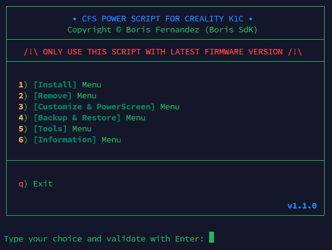
</p>

<table>
  <tr>
    <td align="center"><b>Install</b><br />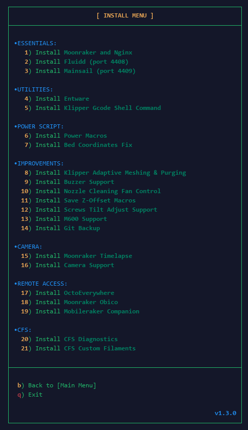</td>
    <td align="center"><b>Information</b><br />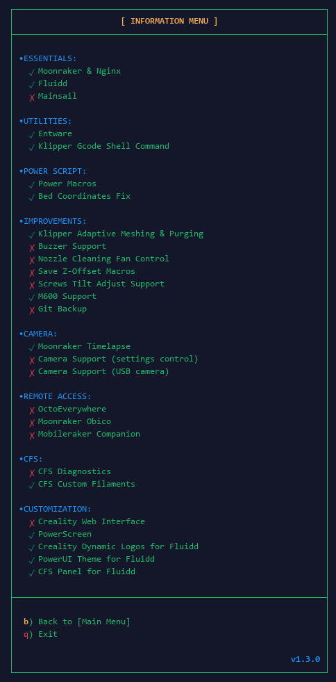</td>
  </tr>
  <tr>
    <td align="center"><b>Customize &amp; PowerScreen</b><br />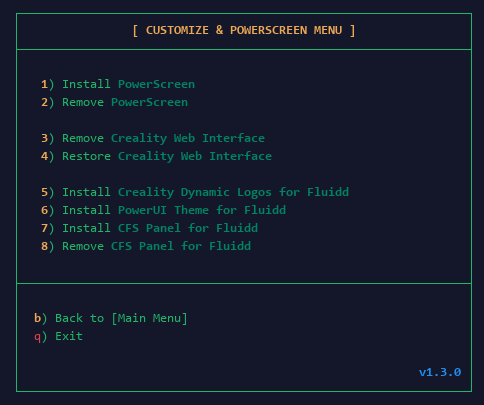</td>
    <td align="center"><b>Tools</b><br />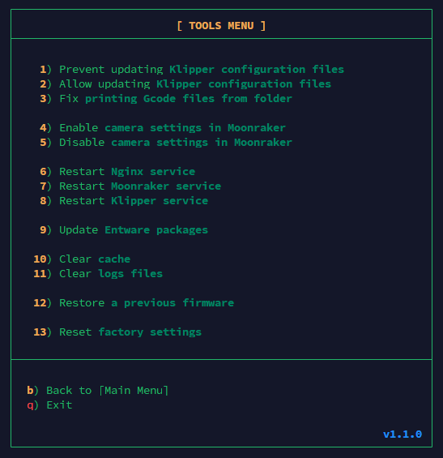</td>
  </tr>
  <tr>
    <td align="center"><b>Backup &amp; Restore</b><br />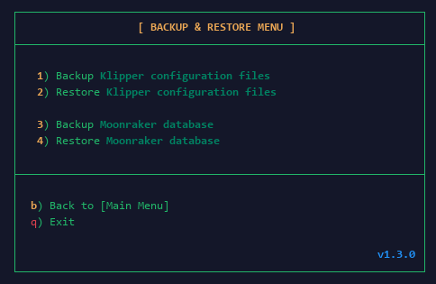</td>
    <td></td>
  </tr>
</table>

### CFS card for Fluidd

<p align="center">
  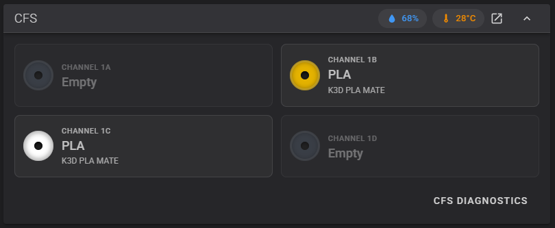
</p>

<table>
  <tr>
    <td align="center"><b>Edit a spool</b><br />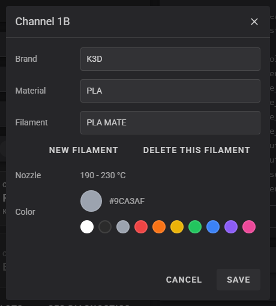</td>
    <td align="center"><b>New filament</b><br />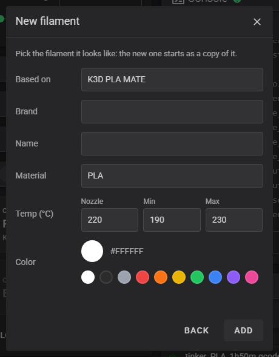</td>
  </tr>
  <tr>
    <td align="center"><b>CFS Diagnostics</b><br />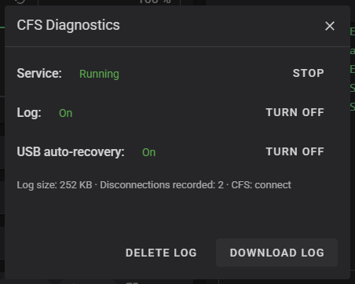</td>
    <td></td>
  </tr>
</table>

## Modules

### PowerScreen

```text
[Customize & PowerScreen] Menu → 1) Install PowerScreen
```

PowerScreen replaces the Creality touch screen. Before installing, the script
shows a warning and asks for confirmation, because the Creality screen and the
Creality services (Creality Cloud, Creality Print LAN connection and OTA firmware
updates) are **disabled**. It then asks which build to install (`stable` or
`nightly`). Everything is backed up and restored with
`[Customize & PowerScreen] Menu → 2) Remove PowerScreen`.

### Power Macros

```text
[Install] Menu → 6) Install Power Macros
```

Installs the Power Script macros and parameters:

- **Replaces** `gcode_macro.cfg`, `printer_params.cfg` and `box.cfg` with the Power Script versions, and adds the `[include gcode_macro.cfg]`, `[include printer_params.cfg]` and `[include box.cfg]` lines to `printer.cfg` when they are missing. The versions add the `STRESS_TEST` (motion stress test), `PID_HOTEND` (hotend PID calibration) and `RELOAD_CAMERA` (restart the camera service), `CAMERA_OFF` and `CAMERA_ON` (turn the camera off and on) macros.
- - Sets the CFS purge to a single 100 mm purge per color change in `box.cfg` (`box_first_clean_length`, `box_need_clean_length`, `box_need_clean_length_max` and every `Tn_extrude` at 100), instead of the Creality 140 mm purge done twice. The firmware purges in whole rounds of that length, so you get a single round only while the flushing volume of the slicer is about 240 mm³ or less; above that it purges twice (see [Double purge on color changes](#double-purge-on-color-changes-orcaslicer)). Klipper refuses to start if `box_need_clean_length` is larger than `box_first_clean_length`.
Keeps `START_PRINT` disabled when KAMP is installed, because KAMP provides its own.

Requirement: *Klipper Gcode Shell Command* must be installed (`RELOAD_CAMERA` needs it).

#### Camera off and on

<p align="center">
  
</p>

`CAMERA_OFF` stops the camera service (`cam_app` and `mjpg_streamer`) and `CAMERA_ON` starts it again, from the Fluidd *Macros* panel, the console, or the **camera icon at the top right of the PowerScreen title bar** (next to the Wi-Fi icon and the clock): tap it to switch. The picture above shows the icon with the camera **off** (crossed out); with the camera on it is green and without the cross. PowerScreen asks for confirmation if you turn the camera off while printing. While the camera is off it stops using the USB hub it shares with the CFS adapter, which is useful to check whether the video traffic has to do with the CFS disconnections, and there are no timelapse photos. The camera comes back on its own after a restart of the printer. To get these macros on a printer that already has the Power Macros, install them again (`[Install] Menu → 6`).
Before replacing anything, the first copy of each file is saved in
`/usr/data/helper-script-backup/power-config/` and is never overwritten.
`[Remove] Menu → 6) Remove Power Macros` restores those originals.

### Bed Coordinates Fix

```text
[Install] Menu → 7) Install Bed Coordinates Fix
```

**The problem.** The CFS firmware for the K1C misaligns the bed coordinates and their limits. As a result:

- The nozzle does not pass over the cleaning brush when it wipes itself.
- The slicer cannot use the Y axis beyond 215 mm, although the bed is 220 mm deep.
- The default bed mesh area leaves the edges of the bed unmeasured, so the mesh is incomplete.

**What the fix does.** It corrects the coordinates and limits so the whole bed is usable and the nozzle wipes on the brush. It changes only these keys of `printer.cfg` and does not need any other module:

| Section | Key | Value | Purpose |
|---|---|---|---|
| `[stepper_y]` | `position_endstop`, `position_min` | `-0.5` | Y origin and lower limit |
| `[stepper_y]` | `position_max` | `227.5` | Y travel, enough to reach the brush area |
| `[stepper_y]` | `gcode_position_max` | `220` | Maximum Y the slicer can use (the full depth of the bed) |
| `[prtouch_v2]` | `clr_noz_start_x`, `clr_noz_start_y`, `clr_noz_len_x`, `clr_xy_quick_spd` | `59`, `223`, `25`, `70` | Nozzle wipe on the brush: from X 59 to X 84 at Y 223, at 70 mm/s (the firmware default is 100). `clr_noz_start_y` is left as a single value: the firmware only uses the first of its `#`-separated values (`223#205#210#223`), so the rest is removed |
| `[bed_mesh]` | `mesh_min`, `mesh_max` | `1,1`, `220,215` | Area probed by the bed mesh: X from 1 to 220 and Y from 1 to 215. Y stops at 215 because the toolhead collides beyond it, so the mesh is more complete without reaching that point |

**Bed leveling.** The bed mesh now probes from `1,1` to `220,215`. The firmware default is `10,10` to `210,210`, which leaves a border of about 10 mm without measurement. The mesh grows to cover almost the whole bed: X reaches 220 mm and Y stops at 215 mm, because the toolhead collides beyond that point on the Y axis.

**Result.** With the fix installed, Y can be used up to 220 mm in the slicer, the nozzle passes over the cleaning brush and the bed mesh covers the bed up to X 220 and Y 215 instead of leaving the edges out.

**Backup and removal.** The original values are saved in `/usr/data/helper-script-backup/bed-fix/`.
`[Remove] Menu → 7) Remove Bed Coordinates Fix` puts them back without touching the includes added by other modules.

### M600 Support

```text
[Install] Menu → 13) Install M600 Support
```

The CFS firmware does not define `M600`. This module adds it so the slicer can
insert manual filament changes:

1. Add `M600` in the slicer at the layer where the color must change (or let the filament sensor trigger it when the filament runs out).
2. The printer pauses, parks the toolhead and unloads the filament.
3. With PowerScreen installed, the **MANUAL FILAMENT CHANGE** menu opens (`UNLOAD`, `LOAD`, `RESUME`, `STOP`, `CLOSE`). `LOAD` and `UNLOAD` are disabled while a print is running. Without PowerScreen, a Mainsail/Fluidd prompt is shown instead.
4. Change the filament with the buttons and press `RESUME` to continue the print.

The module does not override the CFS `RESUME`: it adds `M600_RESUME` and
`M600_CANCEL`, which restore the fan, the idle timeout and the module state and
then call the firmware commands. The automatic CFS color changes do not use `M600`.

### Creality Dynamic Logos for Fluidd

```text
[Customize & PowerScreen] Menu → 5) Install Creality Dynamic Logos for Fluidd
```

Adds a single **Creality** theme to Fluidd, with the Creality logo in the Creality green (`#8EB631`, measured
on the official Creality boot image), and selects it. It adds the theme to the Fluidd `config.json`
without replacing it, so the themes of your Fluidd version are kept. If a Fluidd update removes it, the
script adds it back the next time it starts. The old *Creality V1* and *Creality V2* themes are replaced by
this one. Fluidd needs Moonraker running to remember the selected theme; if it is not running, pick Creality in the
Fluidd theme settings. Close the Fluidd tabs and clear the browser cache if the theme does not change.

### PowerUI Theme for Fluidd

```text
[Customize & PowerScreen] Menu → 6) Install PowerUI Theme for Fluidd
```

Adds the **PowerUI** theme to Fluidd and selects it: the Power Script logo in the top bar and as the faint
background logo of the page (Fluidd's own *background logo* setting), and the Power Script green (`#4ADE80`) as the accent
color. **It is applied automatically every time you install Fluidd from this script**, so it is the default theme; choose
another one in the Fluidd theme settings if you prefer. If Fluidd is already installed, run this option once to add the theme.
It is added to the Fluidd `config.json` without replacing it, so the themes of your Fluidd version and the Creality one
are kept. If a Fluidd update removes it, the script adds it back the next time it starts.

Fluidd needs Moonraker running to remember the selected theme; if it is not running, pick PowerUI in the
Fluidd theme settings. Close the Fluidd tabs and clear the browser cache if the theme does not change.

### CFS Panel for Fluidd

```text
[Customize & PowerScreen] Menu → 7) Install CFS Panel for Fluidd
```

Adds a card to the Fluidd dashboard with the look of Fluidd's own cards (see the [screenshots](#cfs-card-for-fluidd) above):

- **The four slots of the CFS box:** a spool in the real color, the material, the remaining filament in meters when the box reports it, and a green dot on the loaded slot. Empty slots are dimmed. With more than one box connected, each box gets its own group.
- **Humidity and temperature of the box.**
- **Click a spool to edit it.** Choose the brand, the material and the filament from the Creality material database (the nozzle temperatures of the filament are shown) and the color, with a picker or a palette. Saving sends the same two commands as the Creality interface and PowerScreen (`BOX_MODIFY_TN_DATA` for `material_type` and `color_value`) and then checks that the CFS reports the change. Editing is blocked while a print is running.
- **Dock or undock.** The card starts docked in the dashboard, below the cards of its column. The button in its title bar undocks it into a floating card that you can drag anywhere, and the same button docks it again. The arrow collapses it, like the one of the Fluidd cards. The mode, the position and the collapsed state are kept in the browser.

The card reads Moonraker only (the `box` object of Klipper and the gcode endpoint): it does not need the Creality web server and it does not change Klipper. It only appears when the printer has a CFS, and it says *CFS disconnected* when the box is not connected.

It is added by copying `power-cfs-panel.js` to the Fluidd folder and adding one `<script>` tag to Fluidd's `index.html`. Fluidd keeps its own page in the browser cache (it is a PWA), so the module also updates the revision of `index.html` in Fluidd's `sw.js`: that is what makes the browsers load the new page. If a Fluidd update replaces those files, the script adds the card back the next time it starts. After installing, close every Fluidd tab and open it again (twice if the card is not there yet); `Ctrl+Shift+R` also works.
`[Customize & PowerScreen] Menu → 8) Remove CFS Panel for Fluidd` takes it out again.

### Camera Support

```text
[Install] Menu → 16) Install Camera Support
```

Installs the macros to adjust the camera (brightness, saturation, contrast...)
and, when you answer yes, USB Camera Support to use a third-party USB camera
(needs Entware). Cameras with the new hardware always get the USB service.
*Klipper Gcode Shell Command* is required.

### CFS Diagnostics (beta)

> **Critical fault and beta status.** The random disconnection of the CFS box is a critical fault of the K1C with the CFS: the print can fail and the box may only come back after unplugging the USB cable. This module and its reconnection script were created because of it. They are in **beta**: the USB reset is proven by hand and in simulation, and it still has to be confirmed on real drops. Use the logs to report what happens.

```text
[Install] Menu → 20) Install CFS Diagnostics
```

Installs a small service (`/usr/data/helper-script/files/cfs-diag/cfs_diag.sh`) that watches the CFS box through Moonraker and writes `/usr/data/printer_data/logs/cfs_diag.log`.

- **What it records:** every time the box goes from `connect` to `disconnect`, a snapshot with the state of the USB adapter, the kernel log and the Klipper log, the duration, and the probable cause (the USB hub disabling the adapter port, the adapter read channel stalling with `urb stopped: -32`, the adapter disappearing, or communication timeouts). A one-line summary per event is kept.
- **USB auto-recovery (on by default when installed):** when the box has been disconnected for 20 seconds, the USB adapter is still present and the printer is **not printing**, it resets the USB device (the same as unplugging and plugging the cable). It tries at most 3 times per event, 60 seconds apart, and at most 6 times per hour, and logs each attempt. It never changes Klipper, the firmware or the box.
- **Macros:** `CFS_DIAG_STATUS`, `CFS_DIAG_SUMMARY`, `CFS_DIAG_SNAPSHOT`, `CFS_DIAG_CLEAN`, `CFS_DIAG_AUTORECOVER_ON`, `CFS_DIAG_AUTORECOVER_OFF`, `CFS_DIAG_LOG_ON`, `CFS_DIAG_LOG_OFF`, `CFS_DIAG_ENABLE` and `CFS_DIAG_DISABLE`.
- **Log size:** the log is rotated at 1 MB and one backup (`cfs_diag.log.1`) is kept, so it never takes more than about 2 MB. `CFS_DIAG_LOG_OFF` stops writing it altogether while the watcher and the USB auto-recovery keep running (`CFS_DIAG_DISABLE` stops everything, recovery included).
- **From Fluidd:** with the CFS Panel for Fluidd installed, the card has a **CFS DIAGNOSTICS** button. Its window shows the state, turns the service, the log and the USB auto-recovery on and off, downloads the log (and the previous one) and deletes it. It only needs the macros above, so it appears once CFS Diagnostics is installed.

Requirement: *Klipper Gcode Shell Command* must be installed.
`[Remove] Menu → 20) Remove CFS Diagnostics` turns the auto-recovery off, stops the service and removes the macros; the log is kept.

### CFS Custom Filaments

```text
[Install] Menu → 21) Install CFS Custom Filaments
```

Most spools have no RFID tag, so the CFS does not know what they are and they show as *Not set*. This module lets you add filaments of your own to the material database of the K1C and then choose them for a slot, so that PowerScreen and the CFS card of Fluidd show what the spool really is, for example *K3D PLA MATE*.

- **Add a filament:** open a spool in the CFS card of Fluidd and press **New filament** (the button only appears when this module is installed). Pick a similar filament as the base, because the new one starts as a copy of it, and give it a brand, a name, the material, the nozzle, minimum and maximum temperatures and a color. Names use letters, digits, spaces and `. _ + -`, up to 24 characters.
- **Delete a filament:** **Delete this filament** in the same editor. Spools that were using it show as an unknown material until you choose another one.
- **Ids:** the new filaments get the ids `90001` to `99999`; Creality uses `00001` to `29001`, so they never collide.
- **Where it writes:** `material_database.json` and `material_option.json` in `/usr/data/creality/userdata/box`. The first time, a copy of both originals is kept in `/usr/data/backup-cfs-materials`, and every file is written whole and checked before it replaces the old one. Your own list is kept in `/usr/data/printer_data/config/Helper-Script/cfs-custom-materials.json`.
- **Firmware updates:** an update restores the original database. The next time the script starts it puts your filaments back from that list.
- **PowerScreen** reads the material database when it starts: restart PowerScreen (or the printer) to see a new filament there. The CFS card of Fluidd shows it right away.
- **Macros:** `CFS_ADD_MATERIAL`, `CFS_REMOVE_MATERIAL` and `CFS_LIST_MATERIALS`. They refuse to run while printing. Values have no spaces: a `~` stands for a space and the color is `RRGGBB` without `#`:

  ```text
  CFS_ADD_MATERIAL BASE=00001 BRAND=K3D NAME=PLA~MATE TYPE=PLA NOZZLE=220 MIN=190 MAX=230 COLOR=FFFFFF
  CFS_REMOVE_MATERIAL ID=90001
  ```

Requirement: *Klipper Gcode Shell Command* must be installed (the install adds an `include` to `printer.cfg` and restarts Klipper).
`[Remove] Menu → 21) Remove CFS Custom Filaments` removes the macros but **keeps your filaments** in the database. To take them all out: `sh /usr/data/helper-script/files/cfs-materials/cfs_materials.sh remove-all`.

### Boot animation

The first time the script runs it replaces the boot animation in
`/etc/boot-display` with the Power Script one (see the preview above). The original animation is saved in
`/usr/data/helper-script-backup/boot-display-original.tar.gz`. There is no menu
entry: if a firmware update restores the Creality animation, clone the script
again to apply it again.

## Updates

The script checks for a new version every time it starts and offers to update
itself. Installed components with an update manager entry can also be updated
from Fluidd or Mainsail (**Settings → Software Updates**).

## Menus

| Menu | Content |
|---|---|
| `[Install]` | 1 Moonraker and Nginx, 2 Fluidd, 3 Mainsail, 4 Entware, 5 Klipper Gcode Shell Command, 6 Power Macros, 7 Bed Coordinates Fix, 8 KAMP, 9 Buzzer Support, 10 Nozzle Cleaning Fan Control, 11 Save Z-Offset Macros, 12 Screws Tilt Adjust Support, 13 M600 Support, 14 Git Backup, 15 Moonraker Timelapse, 16 Camera Support, 17 OctoEverywhere, 18 Moonraker Obico, 19 Mobileraker Companion, 20 CFS Diagnostics, 21 CFS Custom Filaments |
| `[Remove]` | The same 21 entries, plus *Improved Shapers Calibrations* (`x`), *Fans Control Macros* (`y`) and *Useful Macros* (`z`) when they are installed |
| `[Customize & PowerScreen]` | 1 Install / 2 Remove PowerScreen, 3 Remove / 4 Restore the Creality Web Interface, 5 Creality Dynamic Logos for Fluidd, 6 PowerUI Theme for Fluidd, 7 Install / 8 Remove CFS Panel for Fluidd |
| `[Backup & Restore]` | Klipper configuration files and Moonraker database |
| `[Tools]` | Klipper configuration updates, printing G-code files from folders, camera settings, service restarts, Entware updates, cache and log cleanup, firmware restore and factory reset |
| `[Information]` | Installed components and their status |

## Known issues

### KAMP and the CFS purge

The CFS firmware purges as part of the `START_PRINT` routine, but with the CFS
the filament is often not loaded yet at that point. The KAMP module splits the
purge from `START_PRINT` so the printer does not try to purge before loading
filament. To purge, add `ADAPT_PURGE_MOD` to the end of the slicer start G-code.
Enabling a skirt in the slicer is also recommended to prime the nozzle.

#### KAMP settings are saved

The bed mesh type (adaptive, full or none) and the purge line type (adaptive or classic) are chosen from
the KAMP settings menus (`KAMP_BED_MESH_SETTINGS` and `KAMP_PURGE_LINE_SETTINGS`, also available as macros
in PowerScreen). Your choice is saved in `variables.cfg`, the same file that Save Z-Offset uses, and it is
restored when Klipper starts, so it is no longer reset to *adaptive* on every restart. Until you choose
something, the defaults are the adaptive bed mesh and the adaptive purge line.

### Double purge on color changes (OrcaSlicer)

On a CFS color change the firmware purges in rounds of a fixed length (`box_need_clean_length`: 100 mm with the Power Macros, 140 mm in the Creality original) and every round is pushed whole. The slicer asks for a flushing volume in mm³, the firmware converts it to a length (`volume / 2.405` mm for 1.75 mm filament) and the number of rounds is that length divided by the round, rounded up. With the 100 mm round, a volume above about **240 mm³** needs a second round, so the printer purges **twice**. This applies to files that do not purge in the prime tower (`purge_in_prime_tower = 0`), which is the usual case with the CFS.

To keep a single round in OrcaSlicer:

1. Open **Preferences** and disable the automatic calculation of the flushing volumes. Otherwise Orca recalculates them every time the filaments or their colors change and overwrites your values (the dialog says so itself).
2. Open the flushing volumes dialog and set **235** in every cell outside the diagonal (the diagonal stays at 0). Leave the multiplier at 1.
3. Slice again.

<p align="center">
  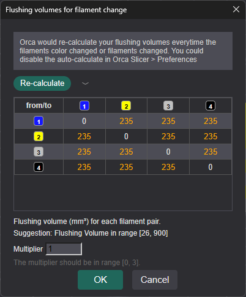
</p>

With 235 mm³ the Klipper log shows `flush_len: 97` and one round, `length: [100]`, on every color change instead of two. Check it with your own filaments: the less filament is purged, the more of the previous color can remain when going from a dark color to a light one. If that happens, raise the value of that pair, keeping it at or below 240.

### Repository error when installing Moonraker

To avoid a repository warning when installing Moonraker, mark it as a safe Git
directory:

```sh
git config --global --add safe.directory /usr/data/moonraker/moonraker
```

## Credits

- [Guilouz](https://github.com/Guilouz) — author of the original
  [Creality Helper Script](https://github.com/Guilouz/Creality-Helper-Script)
  and its [Wiki](https://guilouz.github.io/Creality-Helper-Script-Wiki/).
- [Nik-oli](https://github.com/Nik-oli) — CFS firmware adaptations
  ([Creality-Helper-Script-K1-CFS](https://github.com/Nik-oli/Creality-Helper-Script-K1-CFS)).

## License

This project is licensed under the GNU General Public License v3.0. See
[LICENSE](LICENSE).
